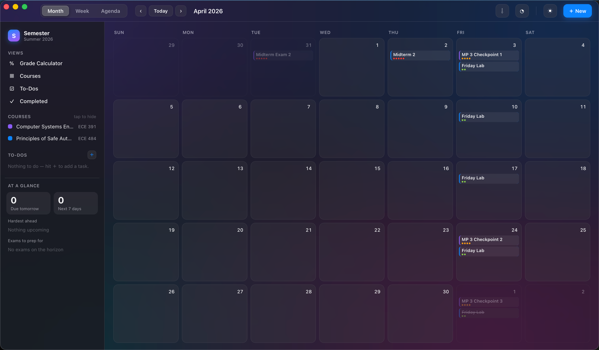
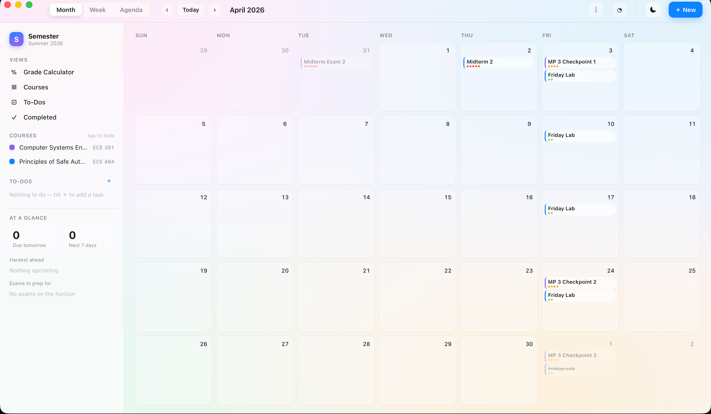
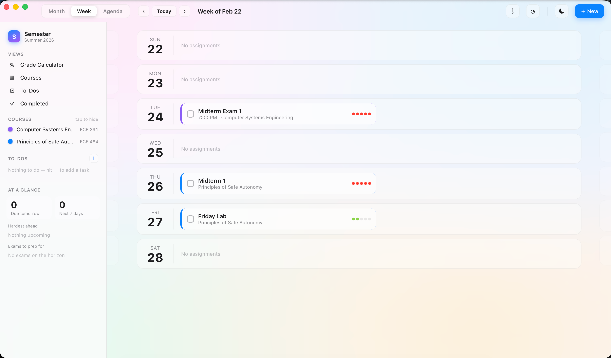
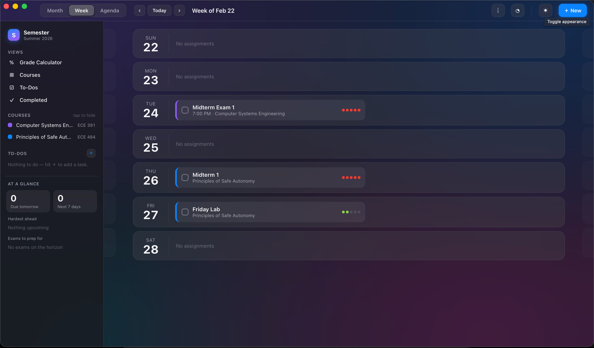
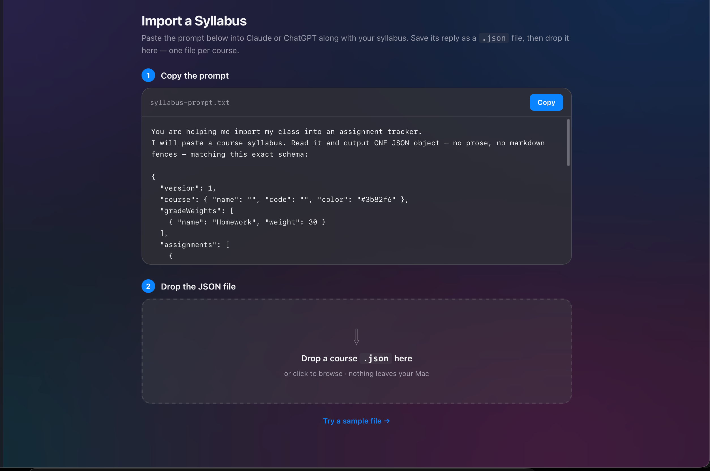

# Semester

A macOS desktop app for tracking a college semester (assignments, exams, personal to-dos, and grades) with an Apple "liquid glass" design. Built with Tauri 2 and vanilla JavaScript (no framework, no bundler).

 

<p align="center">
  
</p>

## Screenshots

The full month and week calendars, in both themes:

<table>
  <tr>
    <th align="center">Light</th>
    <th align="center">Dark</th>
  </tr>
  <tr>
    <td></td>
    <td></td>
  </tr>
  <tr>
    <td></td>
    <td></td>
  </tr>
</table>

Dropping in a syllabus and reviewing what was parsed before it's added:

<p align="center">
  
</p>

## Features

- **Calendar.** Month, Week, and Agenda views with direct-manipulation trackpad scrolling: the calendar follows your fingers 1:1 and snaps to the nearest month/week, with Force Touch haptic ticks at each boundary.
- **Syllabus import.** Copy the built-in prompt into Claude (or any LLM) along with a course syllabus; it returns a JSON file you drop into the app. Assignments, recurring items, TBD dates, and the grading breakdown all import in one shot, with a review step before anything is added.
- **Grade calculator.** Per-course weighted categories (auto-filled from the imported syllabus); enter scores as they come to see your current grade and letter.
- **To-Dos.** Personal tasks alongside coursework, shown in pink on the calendar, with their own page (Overdue / Today / Upcoming) and the top two pinned in the sidebar.
- **Satisfying check-off.** A choreographed completion animation: the checkbox flares in the course color, the title strikes through, and the card morphs into a "done" pill.
- **Due-soon notifications.** Anything unchecked and due within 3 hours triggers a macOS notification (while the app is open).
- **Course editor.** Rename, recolor, or bulk-edit any course's raw JSON; two-step delete.
- **Extras.** "Needs a Date" inbox for TBD items, Completed history, `.ics` export to Apple Calendar, light/dark liquid-glass themes, and everything stored locally.

## Development

Prereqs: Rust toolchain + Node (see [Tauri prerequisites](https://tauri.app/start/prerequisites/)).

```sh
npm install
npm run tauri dev     # run the app
npm run tauri build   # build Semester.app / dmg
```

Frontend lives in `src/` (plain HTML/CSS/JS, served as static files); the Rust shell in `src-tauri/`. There is no frontend build step.

## Importing a course

1. Open the **Import** view (⇩ in the title bar) and copy the prompt.
2. Paste it into Claude/ChatGPT together with your syllabus; save the JSON reply as a `.json` file.
3. Drop the file into the app, review the parsed assignments, and add them to your calendar.

One file per course. Items with unknown dates land in **Needs a Date**; the grading breakdown lands in the **Grade Calculator**.

## Data

Everything is stored locally in the app's web storage (`localStorage`, key `semester-app-v1`), with no accounts and no network. Notifications, the `.ics` save dialog, and trackpad haptics are the only native integrations.